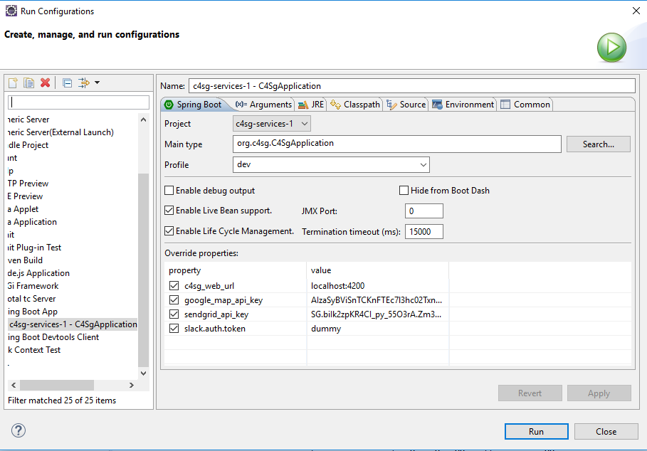

# Local Environment Setup

## 1. Github

### 1.1 Install Git

(Git for Windows)

Link: https://git-for-windows.github.io/

Version: 2.11.0 (as of 1/2/2017)

Installation: accept all the default configuration during installation

### 1.2 Join the repositories
You should receive an email inviting you to collaborate on the repositories. Accept the invitation. There are two Github repositories for this application:
* Frontend Repository: https://github.com/Code4SocialGood/c4sg-web
* Backend Repository: https://github.com/Code4SocialGood/c4sg-services

### 1.3 Fork the repositories

In the top right corner of the repository page, click the button "Fork"

### 1.4 Clone the forked repositories to your local system

#### 1.4.1 Frontend Developer

* Click the button: "Clone or download", copy the web URL. This URL is like: https://github.com/<your_username>/c4sg-web.git
* Click Windows Start button, launch "Git CMD"
* Create a new directory `<your_local_directory>` to copy the repository locally
    cd <your_prefered_path>
    mkdir <your_local_repository_directory>
    cd <your_local_repository_directory>
* Clone the repository to local: 
    git clone https://github.com/<your_username>/c4sg-web.git
* Repository is copied locally to: 
    <your_local_repository_directory>\<your_local_repository_directory>\c4sg-web

#### 1.4.2 Backend Developer

Clone the repository of c4sg-services


## 2. Frontend Development

### 2.1 Install IDE

Install your preferred IDE: Sublime, WebStorm, etc

### 2.2 Install Node.js

* Software: Node.js (we install Node.js in order to get npm package manager from Node.js)
* Link: https://nodejs.org/
* Version: v6.9.2 LTS (as of 1/2/2017)
* Accept all the default configuration during installation

### 2.3 Install npm packages

Click Windows Start button, launch "Node.js command prompt"

Run the commands:
```
cd <path_to_local_repository>\c4sg-web
npm install
```

A new folder is created under C4SGWeb: \node_modules

If you experience this error during npm install, just ignore it: `Environment "${C4SG_NG_ENV-'staging_remote'}" does not exist.`

### 2.4 Test Frontend

Run the command: `npm run start:dev:heroku`

Launch the applicaiton in browser: http://localhost:4200/

Click Projects, verify that you can see test projects retrieved from database.

## 3. Backend Development

## 3.1. Database

### 3.1.1 Install MySQL

#### Software

* Software: MySQL Community Edition
* Link: http://dev.mysql.com/downloads/
* Click: 		MySQL Community Server
* Version: 	5.7.17 (as of 1/2/2017)
* File: https://dev.mysql.com/downloads/windows/installer/5.7.html - (mysql-installer-web-community-5.7.17.0.msi) - 1.7M

#### Installation

Accept all the default configuration during installation.

Some of the components may fail to install. Make sure you have the following installed successfully: 
* MySQL Server
* MySQL Workbench
* Connector/ODBC (?)

MySQL Root Password:
* Enter the password that C4SG configuration uses: mysql
* If you use a different password, please change the config setting in application.properties:
```
Username and secret
spring.datasource.username = root
spring.datasource.password = mysql
```

### 3.1.2 Create the Database 

Launch MySQL Workbench.

Create Schema: c4sg
	
Note: You don’t need to create tables. Table creation is handled by Flyway database migration tool. Tables will be create automatically when you first run the Spring Boot application.

### 3.2 Setup in IDE

* Install your preferred IDE: Eclipse, STS, IntelliJ Idea, etc.
* Import c4sg-services source code.
* Run the application in IDE.
* Make sure MySQL is running.

### 3.3 Test Backend

Test Rest API from  browser: http://localhost:8080/swagger-ui.html

### 3.4 Eclipse Specific Setup

#### 3.4.1 Download Java JDK

* Link: http://www.oracle.com/technetwork/java/javase/downloads/jdk8-downloads-2133151.html
* Version: 8u112 ( as of 1/2/2017)
* Accept all the default configuration during installation

#### 3.4.2 Download Eclipse

* Link: https://eclipse.org/downloads/
* Version: Neon (as of 1/2/2017)
* Type: Eclipse IDE for Java EE Developers

#### 3.4.3 Launch Eclipse

Select a directory as workspace: Click "browse" to create a new folder as your workspace

#### 3.4.4 Install Plugin

* Help -> Eclipse Marketplace
* Install Plugin: 
  * Spring Tool Suite (STS) for Eclipse 3.8.3.RELEASE
  * Buildship

#### 3.4.5 Import project

* File -> Import -> Gradle -> Existing Gradle Project
* Import Source: c4sg-services
* Take all the default settings.

#### 3.4.6 Run application

* Right click on project: C4SGSvc
* Run as: Run Configurations
* In theSpring Boot tab, add properties:

Property | Value
---|---
c4sg_web_url | localhost:4200
google_map_api_key | you can put any dummy value here, unless you work on gencoding.
sendgrid_api_key | you can put any dummy value here, unless you work on email delivery.
slack.auth.token | you can put any dummy value here

* Click Run.



Verify Last line in console: `org.c4sg.C4SgApplication : Started C4SgApplication in 9.852 seconds`

## 4 Full Stack Development

For full stack development, complete Section 2: Frontend Development and Section 3: Backend Development.

Start the backend application locally.

Then run the command: `npm run start:dev:local`

## 5. Test Server and Accounts

### 5.1 DEV Server
http://dev.code4socialgood.org/

### 5.2 Email Login
Volunteer User: testvolunteeruser2@gmail.com / Opensource5social!
Organization User: testnonprofituser2@gmail.com / Opensource5social!

### 5.2 Gmail Login
Volunteer User: testvolunteeruser1@gmail.com / Opensource4social! 
Organization User: testnonprofituser1@gmail.com / Opensource4social! 
 
### 5.3 Facebook Login
Volunteer User: andysmith3099@gmail.com / C4SGfacebook1!

## 6. Development

You are welcome to contribute by working on any issues listed in Github that intereste you.

Questions on collaboration, please contact: info@code4socialgood.org

Join development communication: http://join-our-slack.code4socialgood.org/

***

## Appendix A: Revision History

Date | Version | Description | Author
---|---|---|---
10/18/2017 | 1.0 | Update commands to launch the application in local environment: `npm run start:dev:heroku`, `npm run start:dev:local` | C4SG
10/18/2017 | 1.1 | Remove the property on backend server: `auth0.issuer=https://c4sg-local.auth0.com/` | C4SG
11/14/2017 | 1.2 | Moved this document to github and converted to markdown | SunyataZero
